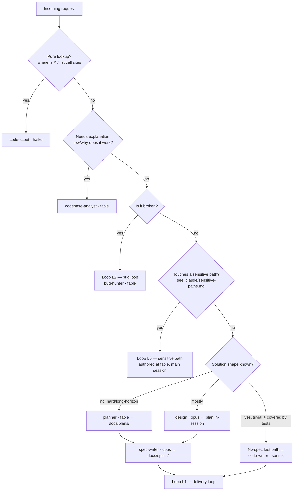
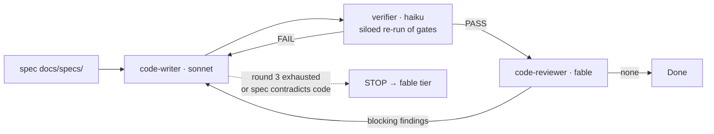
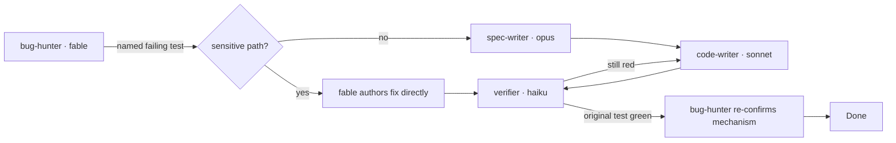

# Agent Orchestration Map — LINDA (Layer B)

> **Scope: Layer B only.** This file describes how Claude Code subagents coordinate
> when developing *this* repo. It has zero effect on the shipped application's own
> LLM calls (Layer A — governed exclusively by
> `backend/app/services/model_catalog.py` / `ModelRouter`). Nothing under `.claude/`
> is read at runtime.
>
> Companion files: [`../CLAUDE.md`](../CLAUDE.md) (routing table + fixed rules),
> [`../.claude/sensitive-paths.md`](../.claude/sensitive-paths.md) (canonical
> sensitive-path list), [`agent-infra-audit.md`](agent-infra-audit.md) (the Layer A
> audit that established the bounded/grounded loop discipline reused below).

---

## Why this file exists

The routing table in `CLAUDE.md` says **which agent** to call. It does not say
**what happens next**. Until now every subagent invocation was a *one-shot
delegation*: a call went out, a report came back to the main session, and the main
session improvised the next step. There were no defined loops, no defined handoff
artifacts, and no defined landing point for an agent that stops and reports.

The result is a set of individually well-specified agents with an unspecified
protocol between them. This file specifies the protocol.

It deliberately reuses the loop discipline the Layer A audit already applied to the
application: **every loop is bounded (a hard iteration cap) and grounded (it
terminates on an external signal — a test result, a concrete finding with
`file:line` — never on an agent's self-assessment).** See
[`agent-infra-audit.md` §(c)](agent-infra-audit.md). No loop below is an ungrounded
self-critique cycle, and no agent may escalate itself.

---

## 1. Triage — where a request enters

**Fast-path rule (new).** A change is eligible for the no-spec fast path only if
*all* of these hold: single file (or one file + its test), no new public behavior,
no new dependency, no sensitive path, and existing tests already cover the area.
Anything else goes through `spec-writer`. This exists because routing a one-line
fix through an opus spec costs more than the fix.

---

## 2. The handoff contract — what actually crosses each boundary

Agents coordinate through **artifacts**, not through vibes. Each handoff has a
defined shape; a handoff that does not produce its artifact has not happened.

| From → To | Artifact | Location | Must contain |
|---|---|---|---|
| `planner` → `spec-writer` | Plan | `docs/plans/<slug>.md` | Ordered steps, `file:line` evidence, risks, which steps are sensitive-path (fable-authored) |
| `bug-hunter` → `spec-writer` | Diagnosis | inline report | Reproduction command + real output, root cause at `file:line`, proposed fix, **the name of the test that must go red→green** |
| `spec-writer` → `code-writer` | Spec | `docs/specs/<slug>.md` | Exact files/functions, pytest cases to add, done-criteria, explicit do-not-touch list |
| `code-writer` → `verifier` | Diff + claimed gates | working tree | The exact commands the spec named |
| `verifier` → main session | Gate report | inline | Command, real output, PASS/FAIL/SKIP per gate — no interpretation |
| `code-reviewer` / `security-reviewer` → main session | Findings | inline | `file:line`, severity, concrete failure scenario |
| `researcher` → any consumer | Unverified claims | inline | Every claim tagged `[source: URL]` `[version: pinned]` |

`docs/plans/` and `docs/specs/` each carry a `README.md` stating this contract.
Before this file existed, `docs/specs/` was mandated by three agent prompts and
**did not exist in the repo**.

---

## 3. The loops

Five loops replace the previous one-shot delegation model. Each is specified as:
**trigger · participants · bound · grounding signal · exit · escalation**.

### L1 — Delivery loop (spec → implement → verify → review → fix)

The core loop. Closes the gap where `code-reviewer` produced findings and nothing
routed them back to an implementer.

- **Trigger:** a written spec, or a fast-path change.
- **Bound:** **2 remediation rounds.** Round 3 is not attempted — the work stops and
  is re-authored at the fable tier with the accumulated evidence attached.
- **Grounding:** verifier gate output (a real pytest result) and reviewer findings
  carrying `file:line`. Never "the writer thinks it's fine".
- **Exit:** verifier reports all gates PASS **and** `code-reviewer` returns no
  blocking findings.
- **Escalation:** `code-writer` never escalates itself. It stops and reports; the
  main session decides. Round-3 exhaustion is an *external* trigger, per CLAUDE.md.

Why `verifier` is separate from `code-writer`: the writer both makes the change and
reports whether it worked, which is the one place in the chain where an agent grades
its own homework. `verifier` is siloed — it receives the gate list and the working
tree, not the implementation rationale — so it has nothing to rationalize with. It
runs on haiku because "run these commands and paste the output" needs no judgment.

### L2 — Bug loop (repro-anchored)

- **Trigger:** a defect report.
- **Bound:** 2 fix attempts.
- **Grounding:** **the original failing test**, named by `bug-hunter` before any fix
  exists. Prose descriptions of a bug are not a grounding signal; a red test is.
- **Exit:** the named test goes green *and* `bug-hunter` confirms the mechanism it
  diagnosed is the one that changed (guards against a fix that masks the symptom).
- **Escalation:** 2 failed attempts → fable re-diagnoses; the fix was aimed wrong.

### L3 — Overlapping review (siloed adversarial lenses)

The only *deliberately overlapping* loop. `code-reviewer` and `security-reviewer`
review the **same diff concurrently and independently** — neither sees the other's
findings — then the main session merges and dedups.

- **Trigger (fixed, not discretionary):** any diff that touches a sensitive path,
  adds an API endpoint or webhook surface, adds a table or migration, or changes an
  LLM-spending path.
- **Bound:** one round each. They do not argue with each other; disagreements land
  in the main session.
- **Grounding:** both must cite `file:line` and a concrete failure/exploit scenario.
- **Why overlapping helps here:** the correctness lens and the tenant-isolation lens
  find different bug classes. A missing RLS registration reads as "fine" to a
  correctness reviewer and as a cross-tenant leak to the security reviewer. Running
  them in sequence lets the first reviewer's framing anchor the second; running them
  siloed does not.
- **Cost note:** this is two fable calls. It is gated to the trigger list above
  precisely so it does not become the default.

### L4 — Preflight gate loop (before push)

- **Trigger:** any push to a branch that will become a PR.
- **Order matters — deterministic first, agentic only on failure.** Run the real
  gates as plain commands; only if one fails does an agent get involved. Most
  preflight failures are mechanical and do not need a model.
- **Bound:** 2 repair attempts, then stop and report.
- **Grounding:** exit codes.
- **Gates:** `pytest -q --ignore=tests/sandbox_demo_ui_test.py`, the import smoke
  check `python3 -c "from backend.app.main import app"`, `npm run lint` in
  `apps/app/` when the SPA changed, plus the drift checks in §5.
- Skipped tests are reported as skips. RLS isolation tests skip without a real
  Postgres — a skip is never reported as a pass.

### L5 — Research verification loop

The `researcher`-output-is-unverified rule was stated in three places but no step
ever *cleared* a claim. This adds the missing step.

- **Trigger:** a spec or plan that depends on an external library's behavior.
- **Loop:** `researcher` (sonnet) emits claims tagged with source + pinned version →
  the consumer (fable/opus, or `code-writer` at implementation time) verifies each
  load-bearing claim against the installed package or `requirements.txt` /
  `apps/app/package.json` → the claim is marked **verified** or **dropped**.
- **Bound:** one verification pass. An unverifiable load-bearing claim is not a
  reason to loop; it is a reason to stop and pick a different approach.
- **Grounding:** the installed code, not the docs.

### L6 — Sensitive-path authoring (not a loop — a ratchet)

Sensitive paths do not loop; they ratchet upward once and stay there. See §4.

### Explicitly NOT recommended

- **Reviewer ↔ writer ping-pong beyond 2 rounds.** Past round 2 the signal is that
  the *plan* is wrong, not the code. Continuing is the coherence trap the Layer A
  audit avoided in the app; do not introduce it in the dev harness.
- **Self-critique passes** ("code-writer, review your own diff"). Ungrounded. The
  verifier + reviewer split already covers this, with real signals.
- **Agents that spawn agents.** No agent has the Agent tool, and that is deliberate:
  fan-out stays visible in the main session, where the cost is attributable and the
  user can interrupt. Loops are encoded as slash commands under `.claude/commands/`,
  not as nested delegation.
- **An agentic loop where a script would do.** Migration-head linearity, stray
  `claude-*` literals, and revision-id length are deterministic checks. Spending a
  model on them is waste — and less reliable.

---

## 4. Escalation ladder (tier ratchet)

Escalation is **always** triggered externally and decided by the caller. No agent
self-assesses and promotes itself.

| External trigger | Action |
|---|---|
| `code-scout` reports "needs interpretation" | → `codebase-analyst` (fable) |
| Spec is ambiguous / contradicts the code | `code-writer` STOPS → `spec-writer`, or fable if the plan is wrong |
| L1 round 3 reached | STOP → fable re-authors with all accumulated evidence |
| L2 second fix attempt fails | STOP → `bug-hunter` re-diagnoses at fable |
| Change touches a sensitive path | → authored at fable **directly**; `spec-writer` and `code-writer` refuse |
| `researcher` claim cannot be verified against the pin | STOP → change approach, do not proceed on the claim |

**Known hole — read this before relying on the sensitive-path rule.** The rule says
sensitive edits are "authored at the fable tier directly", but **no agent in this
repo can both run on fable and write source**: `planner` (fable) is docs-only,
`code-reviewer` / `bug-hunter` / `security-reviewer` (fable) are read-only, and every
agent with `Edit`/`Write` runs on sonnet or opus. In practice "fable tier directly"
therefore means **the main session, which must itself be running on a fable-class
model** — it is not something a subagent can satisfy.

Two ways to close it, both a deliberate cost decision the repo owner should make
rather than something to adopt silently:

1. Add a `sensitive-writer` agent (fable, `Read/Edit/Write/Grep/Glob/Bash`) scoped by
   prompt to the sensitive-path list only. Closes the hole; adds fable write-tier
   spend.
2. Keep the rule as-is and state plainly that sensitive work requires a fable main
   session. Zero added spend; depends on the operator remembering.

Until one is chosen, treat "fable tier directly" as **option 2**.

---

## 5. Territory & write boundaries

`tools:` frontmatter is mechanically enforced by the harness. It **cannot scope
`Write` to a directory** — every path restriction below is prompt-enforced and
therefore advisory (~70% adherence). This table is the canonical statement of them.

| Agent | Model | May write | Enforcement |
|---|---|---|---|
| `code-scout`, `explore`, `codebase-analyst`, `design`, `security-reviewer` | haiku / fable / opus | nothing | mechanical (no write tools) |
| `code-reviewer`, `bug-hunter` | fable | nothing (Bash is run-only) | mechanical for files; **advisory** for Bash-as-editor |
| `verifier` | haiku | nothing (Bash is run-only) | advisory for Bash-as-editor |
| `researcher` | sonnet | nothing | mechanical |
| `planner` | fable | `docs/` only | advisory |
| `spec-writer` | opus | `docs/specs/` only | advisory |
| `code-writer`, `implement` | sonnet | source + tests, **never** sensitive paths | advisory |

**Recommended upgrade (not yet wired):** a `PreToolUse` hook in
`.claude/settings.json` can convert every "advisory" row above into mechanical
enforcement by inspecting `tool_input.file_path` and rejecting out-of-territory
writes and sensitive-path edits. It is not wired here because a hook applies to the
main session too, and a mis-specified matcher would block legitimate work in every
future session — it needs to be authored and tested interactively, not landed blind.
That is the single highest-leverage remaining improvement to this harness.

Note also: `.gitignore` previously ignored all of `.claude/` except `agents/`, so
commands, hooks, and settings could not be versioned at all. That is fixed.

### Drift checks (run in preflight)

The sensitive-path list is repeated inside several agent prompts, because an agent
must be able to honor it without reading another file. The canonical copy is
[`../.claude/sensitive-paths.md`](../.claude/sensitive-paths.md); **if a prompt and
that file disagree, that file wins and the drift is a finding.** Preflight greps for
this.

---

## 6. Agent inventory — overlaps to resolve

Twelve agents, three overlapping pairs. Overlap is not free: at call time the model
must disambiguate between two plausible agents, which is exactly where advisory
routing fails.

| Pair | Overlap | Recommendation |
|---|---|---|
| `explore` (haiku) vs `code-scout` (haiku) | Both read-only search at the same tier | Merge into `code-scout`. Until then: `code-scout` = single symbol / call sites; `explore` = multi-directory inventory sweeps |
| `design` (opus) vs `planner` (fable) | Both produce plans | Keep both, but the split is **tier + output**: `planner` writes `docs/plans/` for multi-release work; `design` returns an in-session plan for single-PR work |
| `implement` (sonnet) vs `code-writer` (sonnet) | Both write code at the same tier | Keep both, but the split is **input**: `code-writer` requires a written spec; `implement` is the no-spec fast path. `implement` previously had **no sensitive-path refusal**, which made it a silent bypass of the rule — fixed |

The three "(pre-existing agent)" entries in `CLAUDE.md` (`design`, `implement`,
`explore`) predate the cost-aware routing work and were never reconciled with it.
The rows above are that reconciliation.

---

## 7. Tooling gaps

| Agent | Gap | Status |
|---|---|---|
| `security-reviewer` | Charted to "flag known-vulnerable pins" with no way to reach a vulnerability database — no Bash, no web tools. The instruction was unsatisfiable. | **Fixed:** `WebSearch` + `WebFetch` added. Stays read-only (no Bash), so `pip-audit` / `npm audit` run from preflight instead |
| `bug-hunter` | Has Bash but was never told to use git archaeology (`git log -S`, `git blame`) — often the fastest answer to "when did this break" | **Fixed:** prompt updated |
| `codebase-analyst` | Charted for "why does this behave this way" but cannot read git history (no Bash) | **Open.** Adding Bash would break its read-only guarantee, which frontmatter cannot restore. Correct fix is a hook-enforced command allowlist; until then, ask `bug-hunter` for history |
| all writers | No independent verification of claimed test results | **Fixed:** `verifier` agent |
| reviewers | No direct PR context — the main session must paste the diff | **Open (environment-dependent).** Where the GitHub MCP server is available, adding `mcp__github__pull_request_read` to `code-reviewer` removes a manual step |

---

## 8. Commands that encode these loops

Loops live as slash commands so they are executed the same way every time, rather
than reassembled from memory each session:

| Command | Loop |
|---|---|
| `/feature <description>` | L1 — plan → spec → implement → verify → review |
| `/bugfix <symptom>` | L2 — repro-anchored bug loop |
| `/review-diff [ref]` | L3 — overlapping siloed review |
| `/preflight` | L4 — deterministic gates + drift checks before push |
| `/sensitive <path>` | L6 — sensitive-path checklist and tier ratchet |
